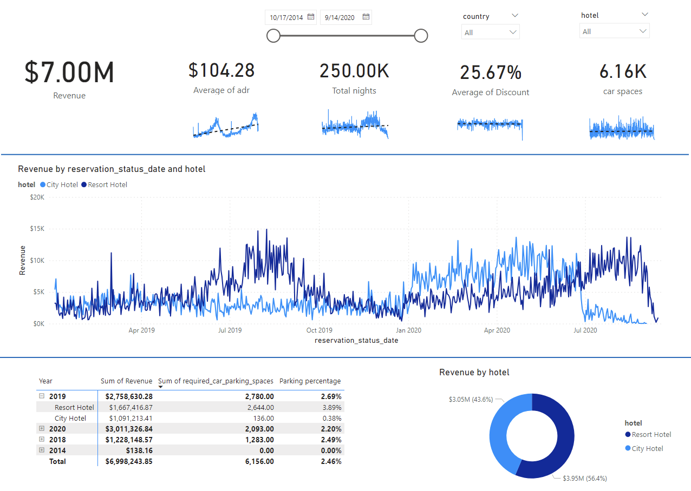

# Ella's portfolio
# [Project 1: Hotel Data Analysis]
This is a project I did in July 2023. I solved 3 problems which the hotel manager asked.
* Data was taken from two hotels' Operational data.
* tools used: SQL, PowerBI
* Helped the hotel managers identify if the hotel revenue growing by year from over 60,000 pieces of business data
* Helped the hotel managers know if they should increase parking lot size.
* Helped the hotel managers know the business trend that can be seen in the data.
## Overview of the hotel data analysis

